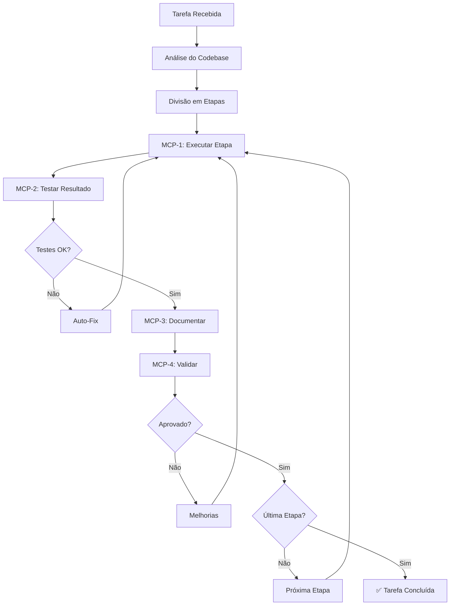

# 🚀 Sistema MCP Orquestrador

[](https://opensource.org/licenses/MIT)
[](https://nodejs.org/)
[](https://github.com/Felipemc13/mcp/issues)
[](https://github.com/Felipemc13/mcp/stargazers)

Sistema completo de automação de tarefas com controle rigoroso de qualidade usando Model Context Protocol (MCP).

## 🎯 O que é o MCP Orquestrador?

O MCP (Model Context Protocol) Orquestrador é um sistema avançado que automatiza tarefas de desenvolvimento com controle total de qualidade:

- 📖 **Lê e entende** todo o codebase do projeto
- 🧠 **Divide tarefas complexas** em etapas específicas e executáveis  
- ⚙️ **Executa rigorosamente** cada etapa com validação completa
- 🧪 **Testa automaticamente** cada resultado
- 📚 **Documenta automaticamente** todo o processo
- ✅ **Valida rigorosamente** antes de avançar
- 🔧 **Corrige automaticamente** problemas encontrados

## 🏗️ Arquitetura

```
┌─────────────────────────────────────────────────────────────┐
│                    Orquestrador Principal                   │
│            (Análise de Codebase + Divisão de Tarefas)      │
└──────────────────────┬──────────────────────────────────────┘
                       │
       ┌───────────────▼───────────────┐
       │          Loop Rigoroso         │
       │    (Não avança com erro)       │
       └───────────────┬───────────────┘
                       │
┌──────▼──────┐ ┌──────▼──────┐ ┌──────▼──────┐ ┌──────▼──────┐
│   MCP-1     │ │   MCP-2     │ │   MCP-3     │ │   MCP-4     │
│ ANALYZER    │▶│  TESTER     │▶│ DOCUMENTOR  │▶│ VALIDATOR   │
│ (Executor)  │ │ (Testes)    │ │ (Docs)      │ │ (Validação) │
└─────────────┘ └─────────────┘ └─────────────┘ └──────┬──────┘
       ▲                                               │
       │◄──────────────────────────────────────────────┘
              (Rejeita e volta se não aprovado)
```

## 🚀 Instalação Rápida

```bash
# Clone o repositório
git clone https://github.com/Felipemc13/mcp.git
cd mcp

# Instale as dependências
npm install

# Configure o ambiente
cp .env.example .env

# Configure o sistema
npm run setup

# Execute
npm start
```

## 📖 Uso

### 🎮 Modo Interativo
```bash
npm start
```

### 📊 Análise de Codebase
```bash
npm run analyze
```

### ✅ Validação do Sistema
```bash
npm run validate
```

### 📈 Status do Sistema
```bash
npm run status
```

## 🎯 Exemplos de Uso

### Criar uma API Completa
```bash
npm start
# Tarefa: "Criar uma API REST completa para gerenciar usuários com CRUD, autenticação JWT e testes"
```

### Corrigir Bugs
```bash
npm start  
# Tarefa: "Investigar e corrigir o erro 500 na rota /api/login"
```

### Implementar Testes
```bash
npm start
# Tarefa: "Implementar testes unitários completos para o módulo de autenticação"
```

### Refatoração
```bash
npm start
# Tarefa: "Refatorar o projeto para usar TypeScript mantendo toda funcionalidade"
```

## 🔧 Comandos CLI

```bash
# Iniciar com tarefa específica
node index.js start --task "Sua tarefa aqui"

# Análise específica
node index.js analyze --path ./src --depth 3

# Limpeza seletiva
node index.js clean --logs --temp

# Configuração inicial
node index.js setup --interactive
```

## ⚙️ Configuração

Personalize via arquivo `.env`:

```bash
# Nível de log (debug, info, warn, error)
LOG_LEVEL=info

# Timeout padrão (ms)
DEFAULT_TIMEOUT=300000

# Auto-fix automático
AUTO_FIX_ENABLED=true

# Score mínimo para aprovação
MIN_APPROVAL_SCORE=70

# Modo verboso
VERBOSE=true
```

## 📊 Funcionalidades Principais

### ✅ Sistema de Análise Inteligente
- 🔍 Detecção automática de linguagens e frameworks
- 📦 Análise de dependências e estrutura
- 🏗️ Identificação de padrões e arquitetura
- 📋 Mapeamento completo do codebase

### ⚙️ Execução Rigorosa e Controlada
- 🎯 Divisão de tarefas em etapas específicas
- 🔄 Execução controlada com validação em cada passo
- 🔧 Sistema de retry e auto-correção automática
- ⏱️ Controle de timeout e performance

### 🧪 Testes Automáticos Abrangentes
- ✅ Verificação de sintaxe em tempo real
- 🚀 Testes de funcionalidade automatizados
- ⚡ Verificação de performance
- 🔄 Testes de regressão
- 🔗 Testes de integração

### 📚 Documentação Automática Completa
- 📝 Documentação de cada etapa executada
- 📖 Atualização automática de README
- 📊 Geração de relatórios detalhados
- 📈 Histórico completo de execução
- 🗂️ Índices organizados automaticamente

### ✅ Validação Rigorosa Multi-Nível
- 🎯 Critérios específicos por tipo de tarefa
- 📊 Scores de qualidade e completude
- ✅ Aprovação baseada em métricas rigorosas
- 📋 Relatórios de validação detalhados
- 🚫 Bloqueio de avanço com erro

## 🔄 Fluxo de Execução Detalhado



## 📈 Monitoramento e Logs

### Logs Detalhados
```bash
# Ver logs em tempo real
tail -f logs/system.log

# Filtrar por componente
grep "MCP-1" logs/system.log
grep "ERROR" logs/system.log
```

### Relatórios Automáticos
- 📊 **Validação**: `logs/validation-reports/`
- 🧪 **Testes**: `logs/test-reports/`
- 📚 **Documentação**: `docs/`
- 📈 **Execução**: `logs/execution-reports/`

## 🤝 Contribuindo

Contribuições são bem-vindas! Veja [CONTRIBUTING.md](./CONTRIBUTING.md) para diretrizes.

1. Fork o projeto
2. Crie uma branch para sua feature
3. Commit suas mudanças
4. Push para a branch
5. Abra um Pull Request

## 📋 Roadmap

- [ ] Interface web para monitoramento
- [ ] Integração com mais linguagens
- [ ] Plugin para VS Code
- [ ] API REST para automação
- [ ] Dashboard de métricas
- [ ] Integração com CI/CD

## 📄 Licença

Este projeto está sob a licença MIT. Veja o arquivo [LICENSE](./LICENSE) para detalhes.

## 🆘 Suporte

- 📖 [Documentação Completa](./docs/)
- 🐛 [Reportar Bugs](https://github.com/Felipemc13/mcp/issues)
- 💡 [Solicitar Features](https://github.com/Felipemc13/mcp/issues)
- 📧 Contato: [felipe@exemplo.com](mailto:felipe@exemplo.com)

## ⭐ Estrelas e Feedback

Se este projeto foi útil para você, considere dar uma ⭐ no GitHub e compartilhar!

---

**Desenvolvido com ❤️ por [Felipe Cavalcanti](https://github.com/Felipemc13)**

*Sistema MCP Orquestrador - Automação Inteligente com Controle Total* 🚀
